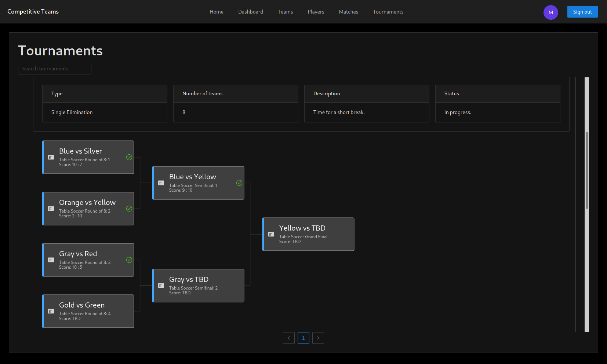
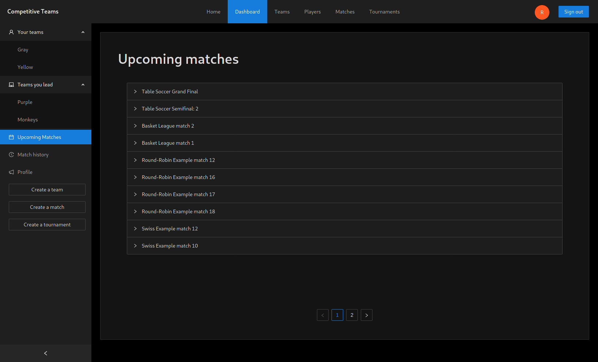

# Competitive Teams 

https://competitive-teams.herokuapp.com

## Description

The goal of this project was to create a web application that lets users create/join teams and helps them host tournaments or matches between those teams. It allows for easy tournament matchup generation in round-robin, swiss, and single-elimination style tournaments while providing a convenient way to keep track of their results.

## Technologies

Main technologies used in the development of this project:

- Frontend: React, Ant Design, G6, React Router, React Query, Axios, Firebase
- Backend: FastAPI, SQLAlchemy, Pydantic, PostgreSQL
- Deployment: Travis CI, Docker, Heroku

## Running the development servers

We've provided a simple bash script for starting and combining the outputs of both servers. To run the servers locally:

<ol>
    <li>Create and configure a new Google Firebase project.</li>
    <li>Export the environmental variables from your Google Firebase project and place them in the <code>frontend/.env.local</code>file with the following syntax:
        <ul>
            <li><code>REACT_APP_FIREBASE_KEY=apiKey</code></li>
            <li><code>REACT_APP_FIREBASE_DOMAIN=authDomain</code></li>
            <li><code>REACT_APP_FIREBASE_DATABASE=projectId</code></li>
            <li><code>REACT_APP_FIREBASE_PROJECT_ID=storageBucket</code></li>
            <li><code>REACT_APP_FIREBASE_STORAGE_BUCKET=messagingSenderId</code></li>
            <li><code>REACT_APP_FIREBASE_SENDER_ID=appId</code></li>
        </ul>
    </li>
    <li>Configure and start your PostgreSQL server.</li>
    <li>Replace the <code>DATABASE_URL</code> variable inside the <code>run-dev.sh</code> script with your PostgreSQL database URL.</li>
    <li>If you'd like to change the default development server ports, make sure to update the <code>REACT_APP_BACKEND_URL</code> variable inside the <code>run-dev.sh</code> script afterwards.</li>
    <li>Install frontend packages with <code>npm install</code> in the <code>frontend</code> directory</li>
    <li>Create a python venv with <code>python -m venv env</code> in the <code>backend</code> directory</li>
    <li>Activate the venv with <code>source ./env/bin/activate</code> in the <code>backend</code> directory</li>
    <li>Install backend packages with <code>pip install -r requirements.txt</code> in the <code>backend</code> directory</li>
    <li>Deactivate the venv with <code>deactivate</code> in the <code>backend</code> directory</li>
    <li>Start the <code>run-dev.sh</code> script.</li>
</ol>
